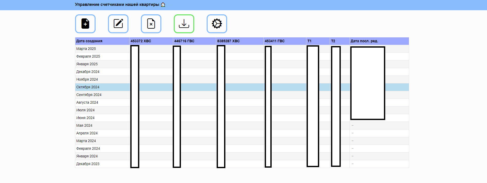
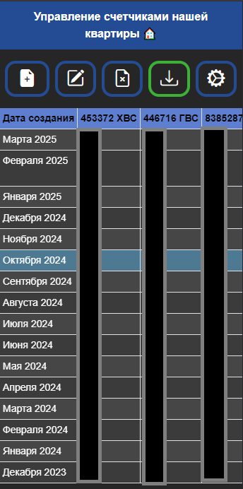
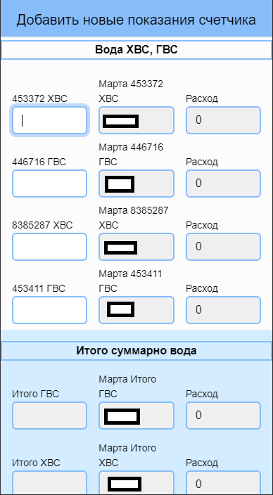
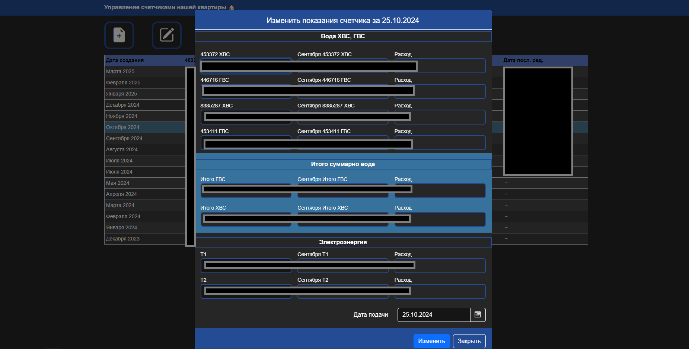
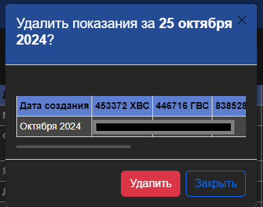

# Фронтенд пет-проект для управления счетчиками квартиры на Angular

## 🚀 Сайт разработчика: [https://mattheweb.ru](https://mattheweb.ru/git-readme-home-countersui)

## Описание ПО
Программа для ведения и управления (добавления/ изменения/ удаления) таблицей счетчиков в моей квартире.  
Интерфейс адаптирован под любые разрешения.
### 🛠️ Cтек 
    @angular/core: 16.2.0
    @auth0/angular-jwt: 5.2.0
    exceljs: 4.4.0
    bootstrap: 5.3.3
    bootstrap-icons: 1.11.3
    typescript: 5.1.3
    CSS 3
    HTML 5
    Intellij IDEA v.2024.3
### Цель ПО
Сделано для удобства, чтобы мобильно и быстро добавлять счетчики, мобильно отслеживать разницу в потреблении воды/энергопотреблении и выгружать показание в .xlsx формат.
  
### Авторизация
Авторизация происходит через ввод пароля и выдачи JWT-токена (guard angular schematic).  
API запросы доступны только после проверки JWT-токена на его действительность (Токен живет сутки).

### Общий вид ПО
#### Главный компонент

#### Главный компонент (мобильная версия/ темная тема)

#### Модальное окно добавления нового показания (мобильная версия)

#### Модальное окно изменения существующего показания (темная тема)

#### Модальное окно удаления существующего показания (мобильная версия/ темная тема)

## Backend

### 🛠️ Стек
 Бекенд написан на Python 3, с помощью Flask фреймворка и библиотек:
 - pymysql
 - pymemcache
### БД
- MySQL 8.0,
- phpMyAdmin
## Ссылки
  
  

## ❗ Важно ❗
Код проекта предоставлен в ознакомительных целях для демонстрации технических навыков разработчика. Проект не будет работать должным образом при самостоятельной сборке ввиду отсутствия доступа к конфиденциальной информации (авторизации).
